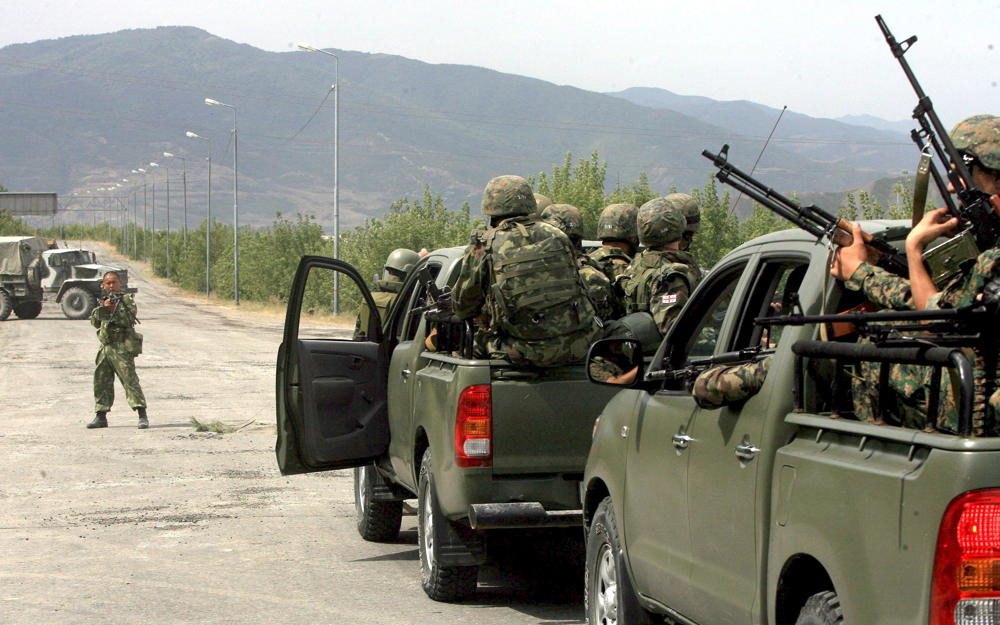
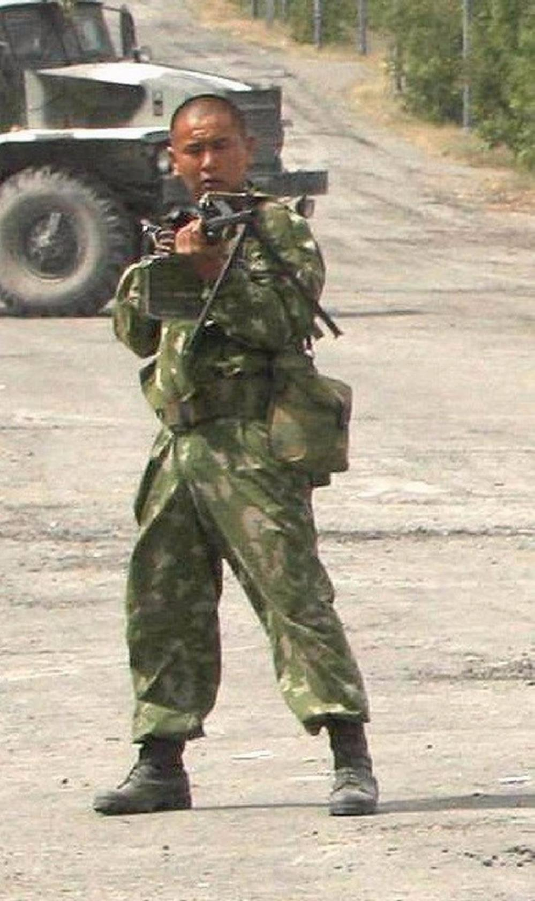

# «300 не надо, хватит и одного»

Это знаменитое фото в августе 2008 облетело мировые газеты.

После разгрома Грузинской армии, её отступившие части перегруппировались 
и решили вернутся в Гори, но наткнулись на российский блокпост. На 
фотографии видно, как солдат ВС РФ, наперевес с пулемётом, противостоит 
мотопехоте ВС Грузии, офицеры колонны угрожали пулемётчику, чтобы тот 
отошел с дороги и пропустил их, на что они услышали в ответ 
«Идитенах..йб...ть». Затем с пулемётчиком пытались поговорить СМИ, 
которые двигались с колонной, и на что получили такой же ответ. В итоге 
колонна развернулась и двинулась туда, откуда приехала.

Иностранные журналисты потом опубликовали статью под названием «300 не 
надо, хватит и одного» (“300 is not necessary, enough for one”).

Героя этой фотографии зовут Бато Дашидоржиев. 

// Источник: [fishki.net](http://fishki.net/anti/1545665-iditenahjbt-ili-300-ne-nado-hvatit-i-odnogo.html)
